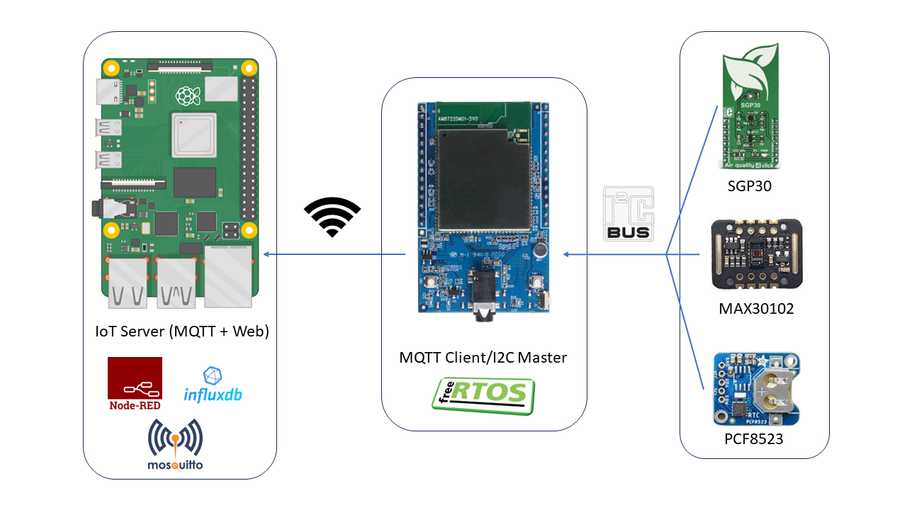

# Progetto di Sistemi Operativi Dedicati
 
Il nostro progetto prevede l'utilizzo di Raspberry Pi 4, in combinazione con la scheda Ameba RTL8722DM Mini e diversi sensori, al fine di misurare il livello di saturazione di ossigeno nel sangue e il battito cardiaco (MAX30102), la qualità dell'aria (SGP30) e un modulo RTC (Real-Time Clock) PCF8523 per la gestione della data e dell'ora. 

L'obiettivo è quello di creare un sistema di monitoraggio IoT in cui i dati raccolti dai sensori vengono visualizzati in tempo reale attraverso una dashboard creata con Node-RED, salvati nel database InfluxDB per l'analisi e protetti mediante la crittografia TLS/SSL.
La seguente figura mostra uno schema del nostro sistema:

 
