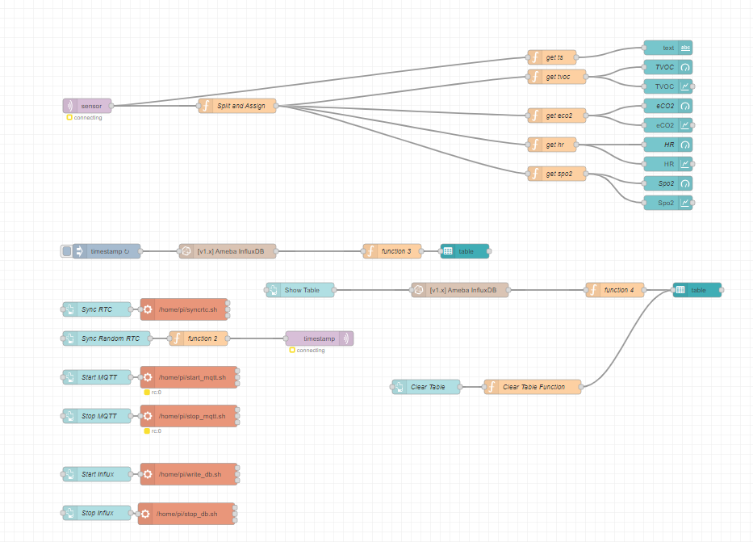
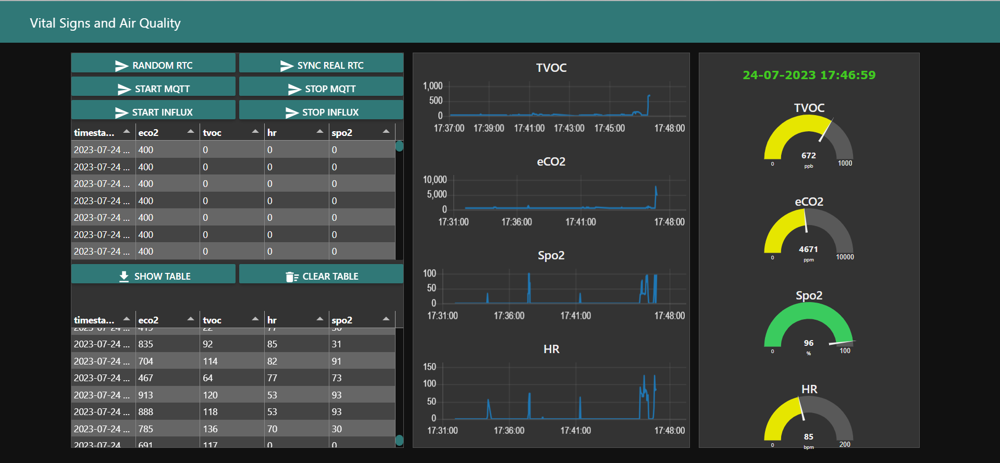

# Cartella Node-RED

Questa cartella contiene i file principali relativi all'applicazione Node-RED.

## Descrizione dei file

### flows.json

Il file `flows.json` contiene il codice sorgente principale dell'applicazione Node-RED. Le flow sono delle rappresentazioni visive di flussi di dati che consentono di connettere nodi ed eseguire logica personalizzata. Puoi importare questo file in Node-RED per ottenere lo stesso setup di flussi definito in questo progetto.

### flows.png

L'immagine `flows.png` è una visualizzazione grafica del diagramma dei flussi contenuti nel file `flows.json`. Questa immagine può aiutare a dare una panoramica visiva dei flussi di dati definiti nel progetto.

### dashboard.png

Il file `dashboard.png` è un'immagine che mostra una schermata di esempio del dashboard creato nell'applicazione Node-RED. Il dashboard è una funzionalità che consente di creare interfacce utente personalizzate per monitorare e controllare i flussi di dati in tempo reale. Questa immagine può servire come anteprima visiva del dashboard creato all'interno di Node-RED.
