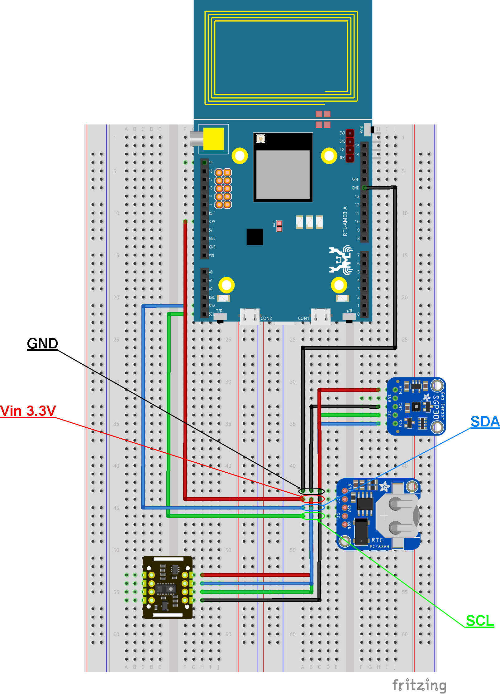

# Cartella Sketch

Questa cartella contiene i file principali relativi agli schemi elettronici e ai progetti di circuiti.

## Descrizione dei file

### Sketch.fzz

Il file `Sketch.fzz` è un file di progetto creato utilizzando il software Fritzing. Fritzing è un'applicazione open-source che consente di creare schemi elettronici, layout di circuiti e PCB (Printed Circuit Board) in modo intuitivo e visuale. Questo file contiene il disegno del circuito e può essere utilizzato per visualizzare e modificare il progetto tramite Fritzing.

### schemaeletr.png

L'immagine `schemaeletr.png` è un'anteprima visiva dello schema elettrico del progetto contenuto nel file `Sketch.fzz`. Questa immagine può aiutare a fornire una panoramica veloce e semplice del circuito creato con il software Fritzing.

